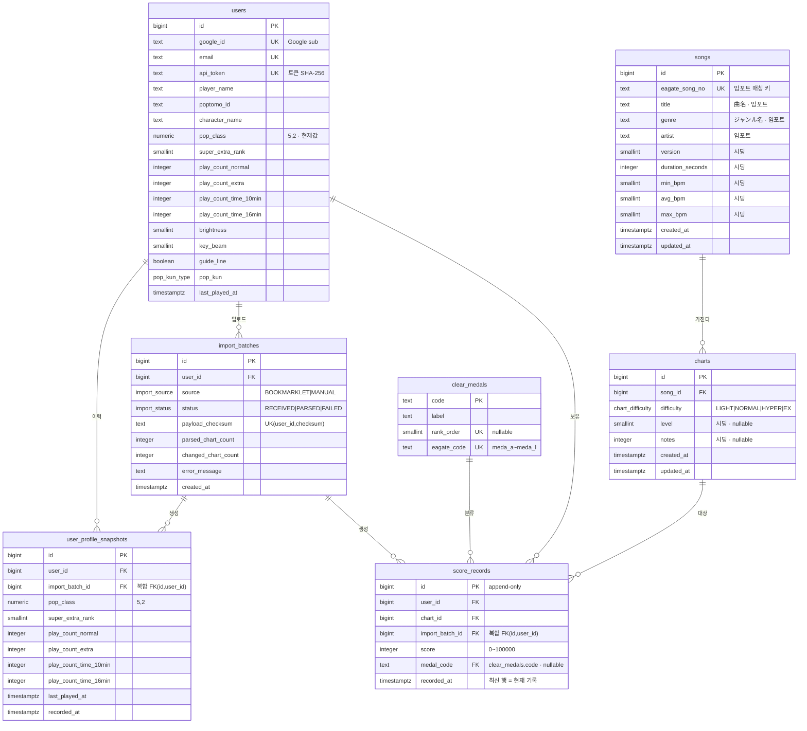

# mnArchive — Pop'n Music 스코어 트래커

e-amusement의 플레이 데이터를 북마클릿으로 수집해 저장하고, 이전 기록과 비교한다.

## 스택

- Java 25 (LTS) / Spring Boot 4.1 / Gradle 9 (Kotlin DSL)
- PostgreSQL + Flyway
- 조회는 JPA, 임포트 배치는 JdbcClient

## 설계 요약

**score_records는 append-only.** 점수 또는 메달 등급이 나아졌을 때만 행을 추가한다.
현재 기록은 `user_chart_current` 뷰(= `(user_id, chart_id)`별 최신 행)로 읽는다.
이력을 덮어쓰면 "이전과 비교"라는 이 서비스의 존재 이유가 사라진다.

**보면(chart)이 행 단위.** 난이도를 컬럼으로 펼치지 않는다.
레벨 기준 조회(`WHERE level >= 45`)와 이력 저장량에서 유리하다.

**수집은 북마클릿.** 확장 프로그램 설치 없이, 이게이트 페이지에서 클릭 한 번.
`scripts/popn-sync.js`가 본체이고 CDN에서 로드된다 — 페이지 구조가 바뀌면 이 파일만 재배포하면
사용자는 아무것도 하지 않아도 된다.

**text/plain + 바디 토큰.** CORS simple request 조건을 만족시켜 프리플라이트를 없앤다.
Authorization 헤더나 application/json을 쓰면 OPTIONS가 발생한다.

## 실행

```bash
# 1. PostgreSQL 기동 (DB/유저/비번 모두 mnarchive)
docker compose up -d

# 2. Google OAuth 자격증명
#    console.cloud.google.com > API 및 서비스 > 사용자 인증 정보 > OAuth 클라이언트 ID
#    승인된 리디렉션 URI: http://localhost:8080/login/oauth2/code/google
export GOOGLE_CLIENT_ID=...
export GOOGLE_CLIENT_SECRET=...

# 3. 기동. Flyway가 V1__init.sql을 적용한다.
./gradlew bootRun
```

`ddl-auto: validate` 이므로 엔티티와 스키마가 어긋나면 기동 자체가 실패한다. 의도된 동작이다.

## 데이터베이스 ERD

`V1__init.sql` 기준. `user_chart_current`는 `score_records` 파생 뷰라 제외했다.



- **프로필 이력 분리.** `pop_class`·플레이 횟수는 시간에 따라 변하므로 `users`에는 현재값만 두고, 이력은 `user_profile_snapshots`가 보관한다. 팝클래스 추이 그래프의 원천이다.
- **`import_batches` 복합 FK.** `user_profile_snapshots`와 `score_records`는 `(import_batch_id, user_id)` → `import_batches(id, user_id)`로 묶여, 남의 배치가 내 데이터를 만드는 상태를 DB가 막는다.
- **시딩 컬럼.** `songs`의 version·bpm·duration, `charts`의 level·notes는 mu_top에 없어 직접 채운다. 임포트는 이 컬럼들을 건드리지 않는다.

## 남은 작업

- [ ] 조회 API — 곡 목록(피벗), 배치 diff, 차트별 점수 추이
- [ ] 프로필 파싱 (팝클래스·플레이 횟수는 메인 페이지에 있음)
- [ ] `scripts/popn-sync.js`의 셀렉터 실검증 — LIGHT/NORMAL/HYPER 점수가 있는 계정 필요
- [ ] `charts.level`, `songs.version/bpm/duration`, `charts.notes` 시딩
- [ ] `clear_medals`의 `meda_l` 정체 확인 (현재 `unknown_l`로 임시 배치)
## API 문서

백엔드를 띄운 뒤 **http://localhost:8080/swagger-ui.html** 에서 모든 엔드포인트를 확인하고
직접 호출해 볼 수 있다. OpenAPI 스펙(JSON)은 `/v3/api-docs`.

### 프론트엔드 연동 요약

Swagger UI 에 나오지 않는 인증 흐름이 있어 여기에 정리한다.

```js
const API = process.env.NEXT_PUBLIC_API_BASE;   // 로컬: http://localhost:8080

// 1. 로그인 상태 확인 (페이지 로드 시)
const res = await fetch(`${API}/api/me`, {
  credentials: 'include',                             // 세션 쿠키 전송에 필수
  headers: { 'X-Requested-With': 'XMLHttpRequest' },  // 401을 받기 위해 필수
});
if (res.ok) { /* 로그인됨 */ } else { /* 로그인 버튼 표시 */ }

// 2. 로그인 시작 — fetch 가 아니라 페이지 이동
window.location.href = `${API}/oauth2/authorization/google`;

// 3. 로그아웃
window.location.href = `${API}/logout`;

// 4. 데이터 조회
const songs = await fetch(`${API}/api/songs?page=0&size=50`, {
  credentials: 'include',
}).then(r => r.json());
```

**주의할 점**

- **로그인은 `fetch` 로 할 수 없다.** OAuth 는 구글 도메인으로 리다이렉트되는 방식이라
  AJAX 로 처리가 불가능하다. 반드시 `window.location.href` 로 페이지를 이동시킨다.
  로그인이 끝나면 백엔드가 `app.frontend-url` 로 되돌려 보낸다.
- **모든 API 호출에 `credentials: 'include'`.** JWT 가 아니라 세션 쿠키를 쓰므로,
  빠뜨리면 쿠키가 실리지 않아 401 이 난다.
- **`/api/me` 에는 `X-Requested-With: XMLHttpRequest` 헤더.** 없으면 미인증 시 401 대신
  구글 로그인 페이지로 리다이렉트되어, fetch 가 HTML 을 받아 CORS 오류처럼 보인다.
- **`POST /api/imports` 는 프론트가 부를 일이 없다.** 북마클릿이 이게이트 페이지에서
  직접 호출하는 엔드포인트이며, 세션이 아니라 개인 토큰으로 인증한다.

### 현재 값이 비어 있는 필드

아래는 스키마에는 있지만 **아직 데이터가 채워지지 않았다.** 프론트에서 null 처리가 필요하다.

| 필드 | 이유 |
|---|---|
| `charts.level`, `notes` | mu_top 에 없어 별도 시딩 필요 |
| `songs.version`, `bpm`, `duration` | 동일 |
| `users.popClass`, 플레이 횟수, `playerName` | 프로필 파싱 미구현 |

`playerName` 이 null 이면 아직 스코어를 한 번도 임포트하지 않은 사용자다 —
프론트는 이걸로 "북마클릿 설치 안내" 화면을 띄울지 판단할 수 있다.

### 팀원이 백엔드를 로컬에서 띄우려면

위 "실행" 절차를 따르되, `GOOGLE_CLIENT_ID` / `GOOGLE_CLIENT_SECRET` 은 저장소에 없다.
**별도 채널(비밀번호 관리자 등)로 전달받아야 한다.** 저장소에 커밋하지 말 것.
